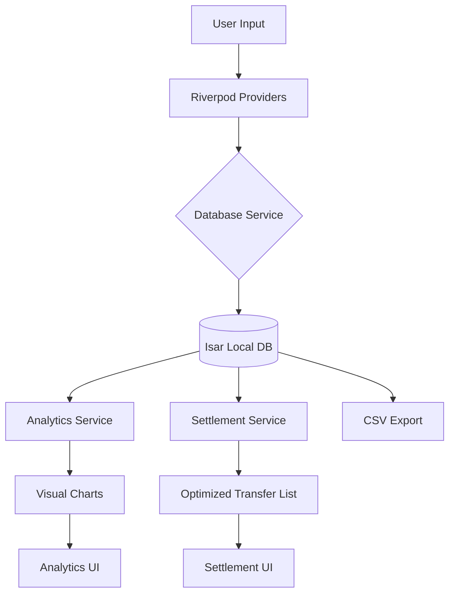

# Campus QuickSplit 🚀

**Split expenses. Settle smarter.**

Campus QuickSplit is a mobile-first expense management tool designed specifically for university students to manage shared costs for housing, food, trips, and more. It eliminates the social friction of shared spending with a powerful Smart Settlement algorithm that minimizes the number of transfers needed to clear debts.

## 🌟 Key Features

### 1. Home Dashboard
- **Personalized Experience:** Displays a warm welcome and your real-time financial standing.
- **Net Balance Analytics:** Instant visibility of total debts (You Owe) and total credits (Owed to You).
- **Quick Actions:** Swift access to add expenses, create groups, or view insights.

### 2. Smart Settlement (The Efficiency Engine)
- **Algorithm-Driven Optimization:** Reduces complex group debts into the minimum number of peer-to-peer transfers.
- **Visual Comparison:** Compare the "Manual Way" against the "QuickSplit Way" to see how many transfers you've saved.
- **One-Tap Settle:** Mark optimized transfers as completed to clear balances instantly in the database.

### 3. Flexible Split Configuration
- **Three Core Split Modes:**
  - **Equally:** Even distribution across all participants.
  - **Exactly:** Assign specific amounts to each member.
  - **By Ratio:** Distribute costs by percentages (e.g., 50/25/25).
- **Real-time Validation:** Prevents allocation mismatches before saving.
- **Multiple Payers:** Supports bills paid by more than one person.

### 4. Spending Insights & Analytics
- **Visual Trends:** 7-day rolling window line charts tracking your daily spending.
- **Categorized Breakdowns:** High-contrast pie charts showing spending by category (Food, Travel, etc.) and by Group (Trip).
- **Dark Mode Optimization:** Charts automatically adapt for maximum readability in all themes.

### 5. Data & Privacy
- **Offline First:** Powered by **Isar NoSQL**, ensuring all data stays on your device for maximum privacy and zero latency.
- **Data Portability:** Export your entire history to a professional CSV report instantly.
- **Customizable:** Multi-currency support (₹/$) and theme vibes (Light/Dark/System).

## 🛠 Tech Stack

- **Framework:** [Flutter](https://flutter.dev/) (3.24+)
- **State Management:** [Riverpod](https://riverpod.dev/) (2.6+)
- **Database:** [Isar](https://isar.dev/) (High-performance NoSQL)
- **Local Storage:** [Path Provider](https://pub.dev/packages/path_provider)
- **Animations:** [Animations Package](https://pub.dev/packages/animations)
- **Charts:** [FL Chart](https://pub.dev/packages/fl_chart)
- **Fonts:** [Google Fonts (Inter)](https://fonts.google.com/specimen/Inter)

## 📊 Data Flow



## 🚀 How to Run

### Prerequisites
- Flutter SDK (v3.24 or higher)
- Android Studio / VS Code with Flutter extension
- An Android device or emulator

### Steps
1. **Clone the repository:**
   ```bash
   git clone https://github.com/roopakv-glithub/Campus_quick_split.git
   cd Campus_quick_split
   ```

2. **Install dependencies:**
   ```bash
   flutter pub get
   ```

3. **Generate Isar models:**
   ```bash
   flutter pub run build_runner build
   ```

4. **Run the app:**
   ```bash
   flutter run
   ```

## 📦 Build Release APK

To generate a production-ready APK:
```bash
flutter build apk --release
```
The resulting file will be located at `build/app/outputs/flutter-apk/app-release.apk`.

---
*Built with ❤️ for GDG Round 2.*
