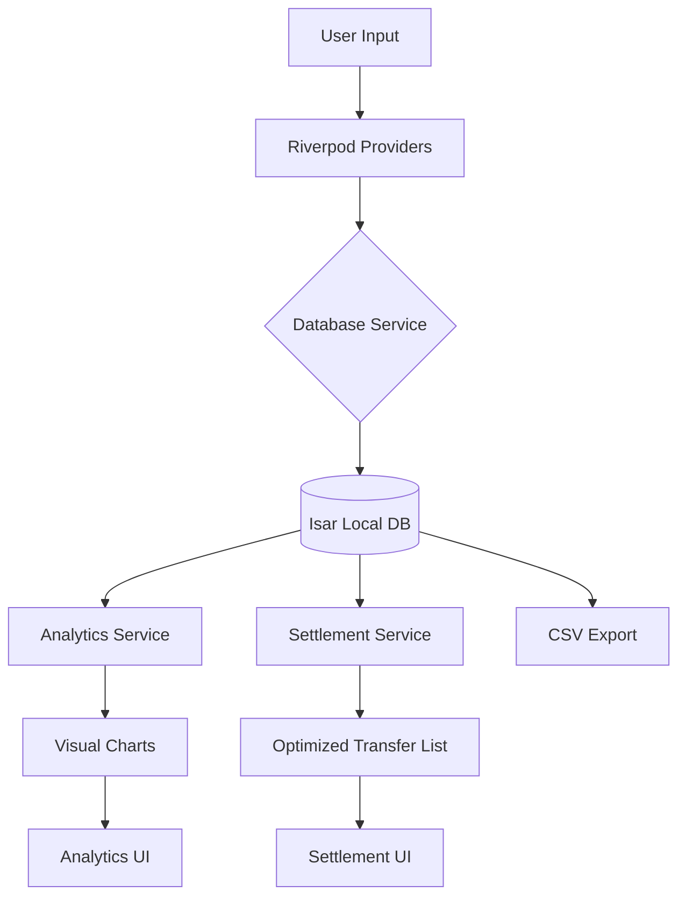

# Campus QuickSplit 🚀

**Split expenses. Settle smarter.**

[](https://quickcampussplit.vercel.app/)

Campus QuickSplit is a mobile-first expense management tool designed specifically for university students to manage shared costs for housing, food, trips, and more. It eliminates the social friction of shared spending with a powerful Smart Settlement algorithm that minimizes the number of transfers needed to clear debts.

## 🌐 Live Demo
Check out the project website: [https://quickcampussplit.vercel.app/](https://quickcampussplit.vercel.app/)

## 🎯 Project Mission
University life involves constant shared spending: group dinners, shared taxi rides, hostel rent, and weekend trips. Tracking these across multiple apps, calculators, and chat groups leads to calculation errors and social friction. 

**Campus QuickSplit** provides a unified, offline-first platform that handles the complexity of "who owes whom" using advanced algorithms, providing students with a transparent and stress-free way to manage group finances.

## 🌟 Key Features

### 1. Home Dashboard
- **Personalized Experience:** Displays a warm welcome and your real-time financial standing.
- **Net Balance Analytics:** Instant visibility of total debts (You Owe) and total credits (Owed to You).
- **Quick Actions:** Swift access to add expenses, create groups, or view insights.

### 2. Smart Settlement (The Efficiency Engine)
- **Algorithm-Driven Optimization:** Reduces complex group debts into the minimum number of peer-to-peer transfers.
- **Visual Comparison:** Compare the "Manual Way" against the "QuickSplit Way" to see how many transfers you've saved.
- **One-Tap Settle:** Mark optimized transfers as completed to clear balances instantly in the database.

### 3. Flexible Split Configuration
- **Three Core Split Modes:**
  - **Equally:** Even distribution across all participants.
  - **Exactly:** Assign specific amounts to each member.
  - **By Ratio:** Distribute costs by percentages (e.g., 50/25/25).
- **Real-time Validation:** Prevents allocation mismatches before saving.
- **Multiple Payers:** Supports bills paid by more than one person.

### 4. Spending Insights & Analytics
- **Visual Trends:** 7-day rolling window line charts tracking your daily spending.
- **Categorized Breakdowns:** High-contrast pie charts showing spending by category (Food, Travel, etc.) and by Group (Trip).
- **Dark Mode Optimization:** Charts automatically adapt for maximum readability in all themes.

### 5. Data & Privacy
- **Local Database (Isar):** Powered by **Isar NoSQL**, a high-performance local database. All your data stays 100% on your device, ensuring maximum privacy and zero-latency access without requiring an internet connection.
- **Data Portability:** Export your entire history to a professional CSV report instantly.
- **Customizable:** Multi-currency support (₹/$) and theme vibes (Light/Dark/System).

## 🛠 Tech Stack

- **Framework:** [Flutter](https://flutter.dev/) (3.24+)
- **State Management:** [Riverpod](https://riverpod.dev/) (2.6+)
- **Database:** [Isar](https://isar.dev/) (High-performance NoSQL for Flutter)
- **Local Storage:** [Path Provider](https://pub.dev/packages/path_provider)
- **Animations:** [Animations Package](https://pub.dev/packages/animations)
- **Charts:** [FL Chart](https://pub.dev/packages/fl_chart)
- **Fonts:** [Google Fonts (Inter)](https://fonts.google.com/specimen/Inter)

## 🛡️ The "Anti-Chaos" Engine: Handling Edge Cases
*Because campus life is messy, but your math shouldn't be.*

> [!TIP]
> **Precision Engineering:** We don't just split numbers; we handle the social and mathematical "glitches" of shared living.

| The "What If" Scenario | Our Creative Solution |
| :--- | :--- |
| **The Missing Cent Mystery** | When splitting ₹100 among 3 people, someone always gets stuck with the extra paisa. We use **Precise Remainder Allocation** logic to ensure the total always matches the bill—down to the last decimal. |
| **The Circle of Debt** | A owes B, B owes C, and C owes A? Instead of three separate transfers, our **Smart Settlement Algorithm** detects loops and nullifies them, potentially reducing your transfers to zero. |
| **The Roommate Pay-Mix** | Giant grocery haul paid by three different people? We support **Multi-Payer Contributions**, allowing you to log exactly who paid what, while still splitting the total cost fairly. |
| **The "Dead Zone" Defense** | Stuck in a basement library with no Wi-Fi? QuickSplit is **100% Offline-First**. Your data is stored in the ultra-fast **Isar NoSQL** database on-device, internet or not. |
| **The "Math is Hard" Guardrail** | Tried to split ₹100 but only assigned ₹90? Our **Real-time Allocation Validator** blocks the "Save" button and highlights the error, saving you from awkward "you still owe me" chats later. |

## 📊 Data Flow



## 🚀 Quick Start
The fastest way to get started is to download the production-ready APK directly from our website:

👉 **[Download APK from Website](https://quickcampussplit.vercel.app/)**

## 🏗 How to Run from Source
If you are a developer and want to run the project locally, follow these steps:
1. **Clone the repository:**
   ```bash
   git clone https://github.com/roopakv-glithub/Campus_quick_split.git
   cd Campus_quick_split
   ```

2. **Install dependencies:**
   ```bash
   flutter pub get
   ```

3. **Generate Isar models:**
   ```bash
   flutter pub run build_runner build
   ```

4. **Run the app:**
   ```bash
   flutter run
   ```

## 📦 Build Release APK

To generate a production-ready APK:
```bash
flutter build apk --release
```
The resulting file will be located at `build/app/outputs/flutter-apk/app-release.apk`.

---
*Built with ❤️ for GDG Round 2.*
